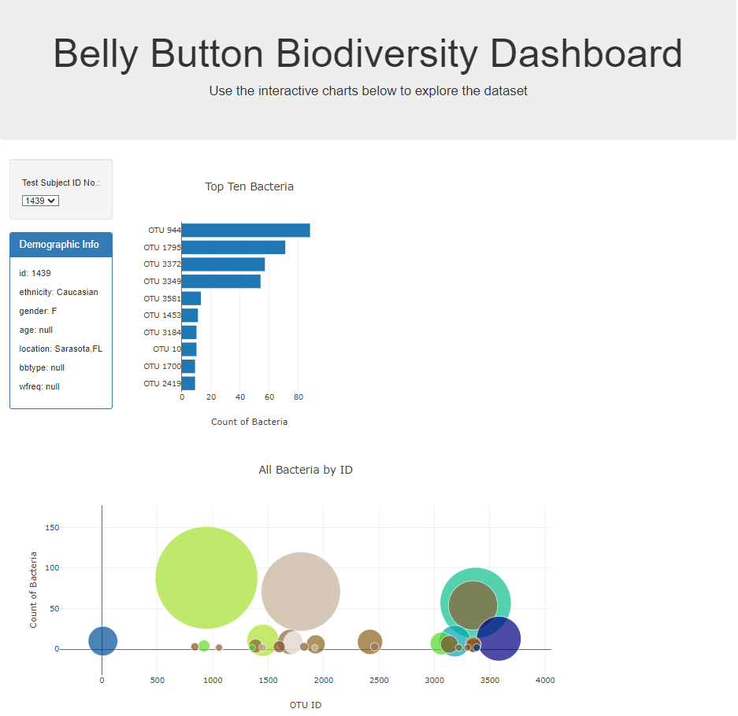

# belly-button-challenge
This repository contains files for UT DAV Bootcamp Module 13 Mini-Project ETL

# File Notes
* index.html contains the starting html code with areas designated to contain the charts
* static\js folder contains the javascript that implements the features stated above
  * app.js contains the solution following the Module 14 Challenge Instructions to implement the features stated above
* samples.json is the sample data provided with the StartCode
* StarterCode folder contains the files downloaded from BCS/Canvas

# Features
* Read the samples.json library in from https://2u-data-curriculum-team.s3.amazonaws.com/dataviz-classroom/v1.1/14-Interactive-Web-Visualizations/02-Homework/samples.json using the D3 library.
* Create a webpage with the following content:
  * Title describing the webiste
  * Dropdown menu with all sample IDs as options
  * Horizontal bar chart with a dropdown menu to display the top 10 OTUs found in that individual
  * Bubble chart that displays each sample
  * Metadata display with individual's demographic information (both names and values)
* Update all data webpage when a new sample ID is selected from the dropdown menu
* Deploy the website to https://vt-bekah.github.io/ (GitHub Pages)
Example View:   

# Getting Started

## Prerequisites
You must have a web browser to view the website and a text editor (or IDE) to view the code

## Cloning Repo
$ git clone https://github.com/vt-bekah/belly-button-challenge.git

$ cd belly-button-challenge

# Built With
* html
* javascript
* D3 library https://d3js.org/d3.v7.min.js
* Plotly https://cdn.plot.ly/plotly-latest.min.js

